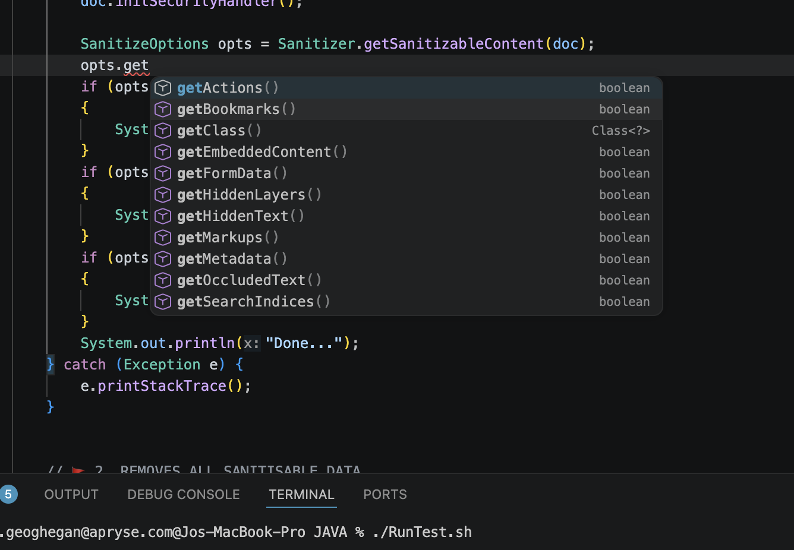

________________________________________________________________________________________________________________________

## Getting Handwriting Sample Working ## 

________________________________________________________________________________________________________________________

1. Navigate to the [Apryse Downloads page](https://dev.apryse.com/) 

2. Select your OS and download the Java sample from Step 3.

3. Unzip the folder.

4. Grab your trial key from the [Apryse Downloads page](https://dev.apryse.com/). If it doesn't appear, create an account and log in, or log in if you already have one.

5. With your OS selected, download the ICR module under "Modules" from the [Apryse Downloads page](https://dev.apryse.com/). 

6. Move the directory "HandwritingICR" from the ICR module (should be at HandwritingICRModuleMac/Samples/TestFiles/HandwritingICR
) to the subdirectory of the Java directory, you should end up with it at Samples/TestFiles/HandwritingICR/icr.pdf. 

7. Navigate to Samples/HandwritingICRTest/JAVA of the Java directory and run the code. 

8. Find icr-prepended files in [this dir](Samples/TestFiles/Output)

________________________________________________________________________________________________________________________

## Sanitisation ##

________________________________________________________________________________________________________________________

Three examples of the [new functionality here](Samples/PDFSanitizeTest/JAVA/PDFSanitizeTest.java) 

🚩 1. CHECK IF PDF CONTAINS METADATA, MARKUPS/VISIBLE ANNOTATIONS OR HIDDEN LAYERS. 
THESE ARE THREE GROUPS OF SANITISABLE DATA.

🚩 2. REMOVES ALL SANITISABLE DATA. 

🚩 3. REMOVES A SUBSET OF SANITISABLE DATA.

Types of sanitisable data you can choose in your opts, see below: 

.

________________________________________________________________________________________________________________________

## Getting MSG/EML Conversion Working ##

________________________________________________________________________________________________________________________

I used the PDF2OfficeTest as a basis, but I recreated it under [EmailToPdfConversion](Samples/EmailToPDFConversion)

We need both the structured output module (as we would with Office), as well as the HTML to PDF module. 

Download HTML to PDF Module [here](https://docs.apryse.com/core/guides/info/modules#html2pdf-module)

Download Structured Output Module on the [Apryse Downloads page](https://dev.apryse.com/).

________________________________________________________________________________________________________________________

## WebViewer Multiviewer Improvements ##

________________________________________________________________________________________________________________________

[See alternative repo](https://github.com/clientProposal/testMultiViewerFromUpdates).
________________________________________________________________________________________________________________________

## Digital Signing, Batch signing methods ##
________________________________________________________________________________________________________________________

Some bulk signing methods added, on top of original tests 1-7

See [runTest1InBulk](Samples/DigitalSignaturesTest/JAVA/DigitalSignaturesTest.java#L706), suggestion for bulk signing.

Used in main [here](Samples/DigitalSignaturesTest/JAVA/DigitalSignaturesTest.java#L997).

See [runTest6InBulk](Samples/DigitalSignaturesTest/JAVA/DigitalSignaturesTest.java#L756), suggestion for bulk custom signing.

Used in main [here](Samples/DigitalSignaturesTest/JAVA/DigitalSignaturesTest.java#L1020).

Apryse is an SDK. For questions on certificates, storage, etcetera, please refer to the [iText whitepaper](https://itextpdf.com/resources/books/digital-signatures-pdf). 

iText is one of Apryse company's flagship products, though the iText and Apryse SDKs are different.

Older notes on digital signatures [here](Notes/notesDigitalSigningSample.md) as reference